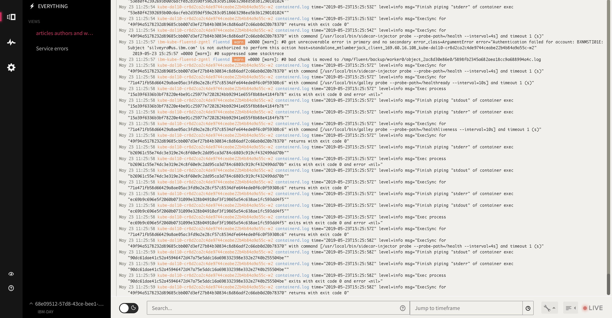
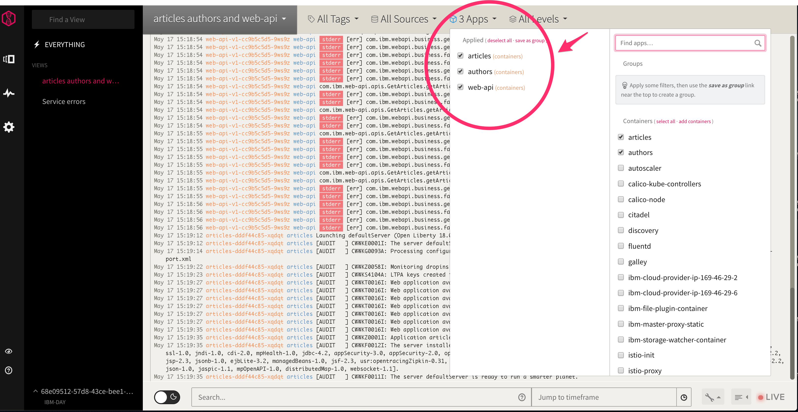
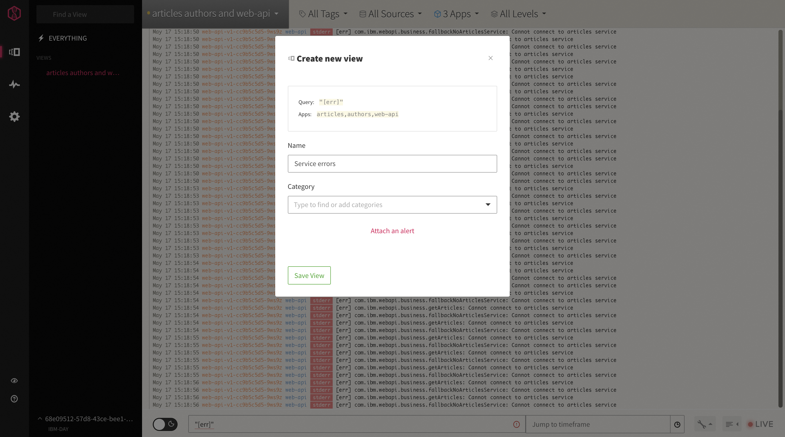
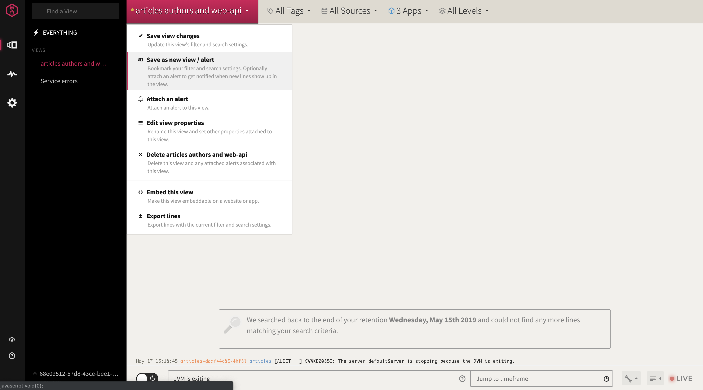
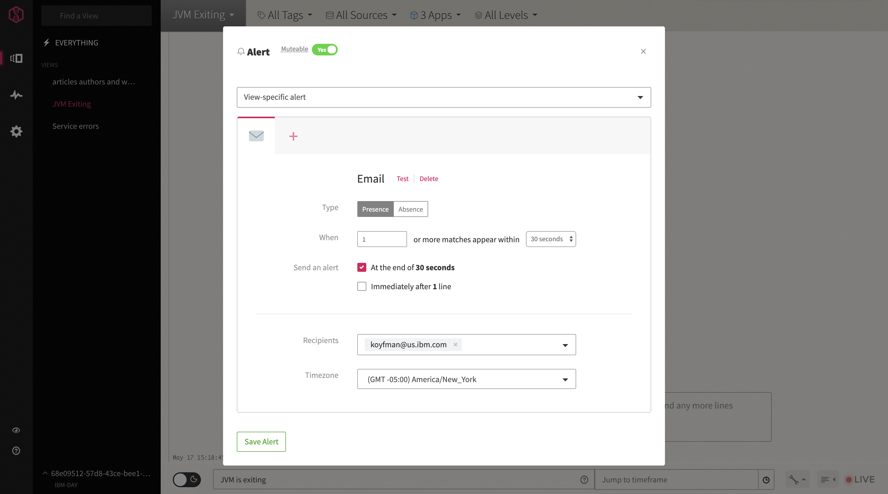
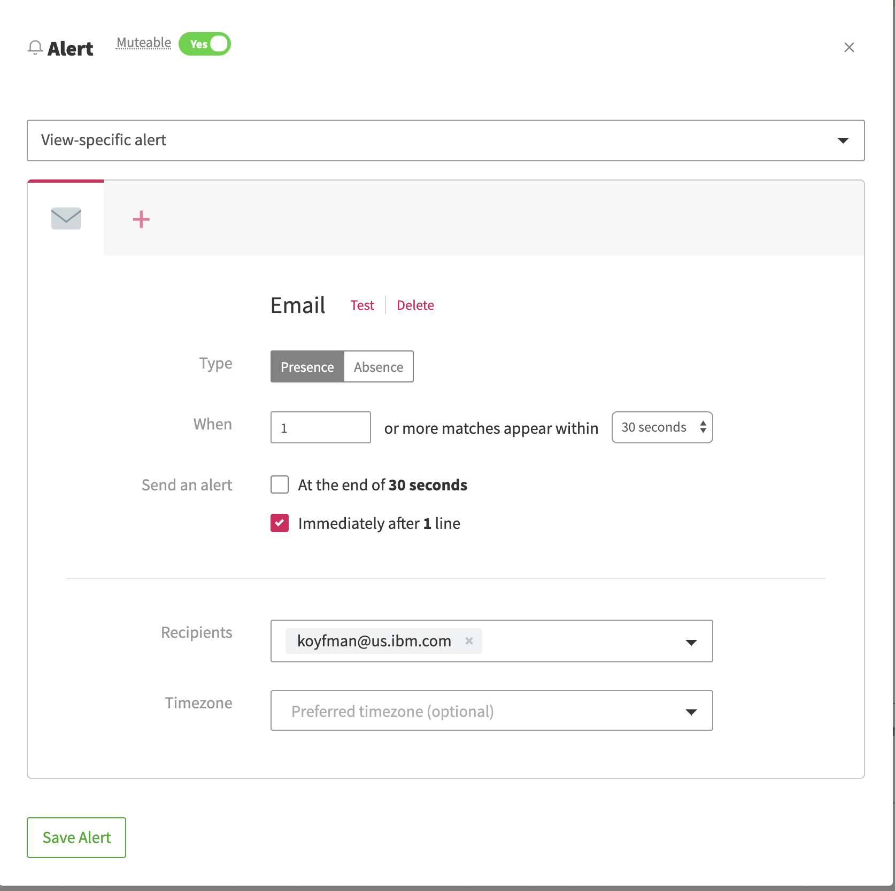
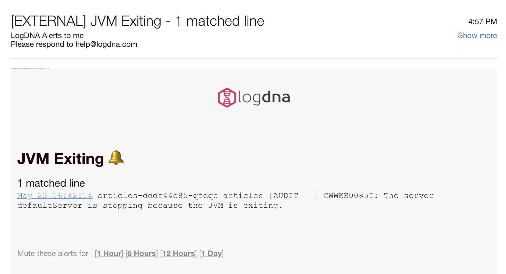
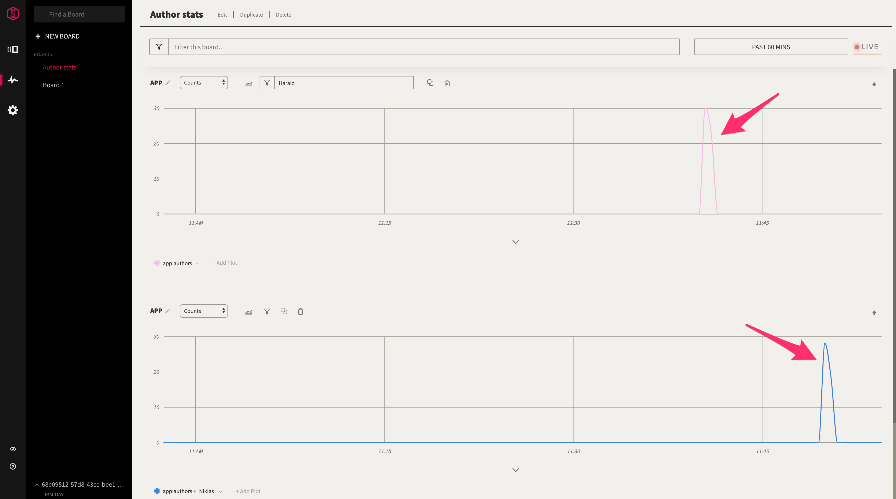
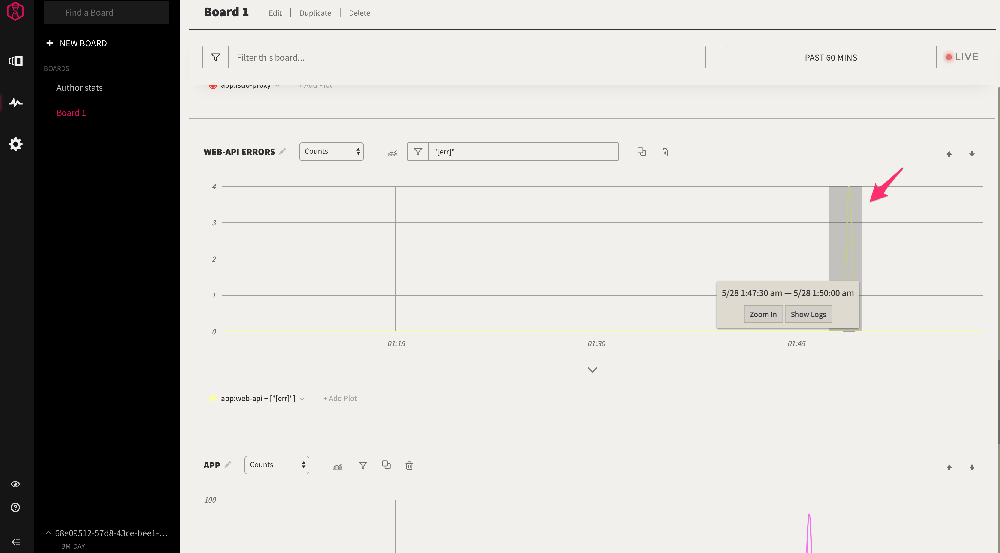
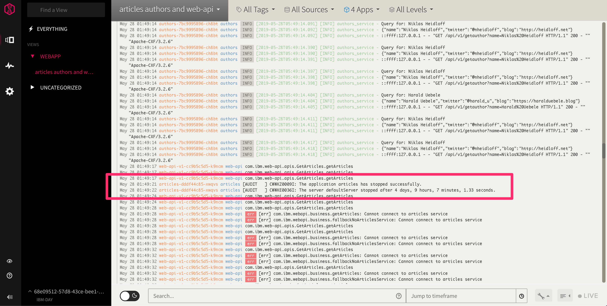

# Better DevOps with LogDNA and IBM Cloud Kubernetes service

# Introduction
	

In his blog post [What's Going On In My Cluster](https://haralduebele.blog/2019/04/08/whats-going-on-in-my-cluster/), my colleague Harald Uebele describes how to connect
the [Native Cloud Starter](https://github.com/nheidloff/cloud-native-starter) microservice-based Web app with the LogDNA service available from IBM Cloud. In this tutorial, we'll expand on that and show some use cases where LogDNA helps
developers and operators with some common production scenarios. Most of this is adapted from personal
experience in building and troubleshooting the [IBM Developer](https://developer.ibm.com/blogs/introducing-the-ibm-developer-mobile-app/). 

# Prerequisites

1. Provision a Kubernetes cluster and install the Web app: This demo is based on the Cloud Native Starter Web app. Details on how to set it up can be found here: https://github.com/nheidloff/cloud-native-starter.  

2. Once the Web app is configured, add IBM LogDNA service by following the instructions here: [What's Going On In My Cluster](https://haralduebele.blog/2019/04/08/whats-going-on-in-my-cluster/).

3. Install the artillery load testing tool: https://artillery.io/docs/getting-started/


# Estimated time

Once a cluster is provisioned, these steps (including setting up LogDNA initially) can all be completed in about an hour.

# Steps


## Scenario 1: Create filtered views 

By default lines from all containers in a Kubernetes cluster are displayed. This creates too much "noise" since a Kubernetes cluster has a number of subsystems and internal pods that the LogDNA agent picks up and indexes. We want to filter the view to only see the applications we're interested in.

### Views from specific containers


LogDNA can separate its logs into buckets, but the type of bucket depends on the kind of cluster. In Kubernetes, this view represents containers. So, in our case we can select containers representing our application to limit the data show.

Prior to filtering, LogDNA is overwhelmed with output from Kubernetes system pods:
 .


From the drop-down list, select the apps we want to view:



After filtering for just the containers we want, the noisy system info is removed and we just see events.
This filtered view can then be saved so it appears in the UI as an entry on the nav panel: . 

Take-way: Filter the view by a combination of "app" selection. In Kubernetes, the apps are containers, which makes it easy to select
just the ones you're interested in.


### Views from search text

Next, let's look at how we can filter by entering a search query. This will be especially helpful for creating alerts based on conditions in the log.

We click on the saved view on the left side of the screen, then enter a search term.  For example, we can set it up to view Java container shutdowns with the phrase "JVM is exiting".

Then select "Save as new view/alert" and choose a name. We'll call it "JVM Exiting" - .

Now we have a new view available on list of views, which includes both the initial app filtering as well as the new search based filter. 

## Scenario 2: Set up alerts from existing views 

Alerts in LogDNA can be triggered whenever log lines appear in a custom view. We'll set up alerts based on the view created earlier to display messages from JVM containers stopping. This alert setup will send emails when new lines appear. We can batch up entries to keep from being overwhelmed repeatedly if many new lines appear in a view attached to an alert.



Let's try to trigger a log based alert. We'll delete one of our pods from the command line.


```
$  kubectl get pods
NAME                         READY   STATUS    RESTARTS   AGE
articles-dddf44c85-xqdqt     2/2     Running   0          5d23h
authors-7bc9995896-f8kv2     2/2     Running   0          8d
client-59b69f46c4-7k6j7      1/1     Running   0          15d
logdna-agent-4rwxl           1/1     Running   0          15d
logdna-agent-jspz8           1/1     Running   0          15d
logdna-agent-xtkfj           1/1     Running   0          15d
web-api-v1-cc9b5c5d5-9ws9z   2/2     Running   0          8d
web-app-f8f47cdfd-qr8rr      2/2     Running   0          8d


[Thu May 23, 02:58 PM] $  kubectl delete pod articles-dddf44c85-xqdqt
pod "articles-dddf44c85-xqdqt" deleted
```

After setting up alerts for Slack and Email - both will be sent simultaneously: 






Notice how the view updates immediately with a message about the container's JVM stopping.

## Scenario 3: API Usage Analysis - how is our API being used?

Next, we'll take a look at the Boards feature of LogDNA. This is a feature I love because it's a great way to visualize
a large quantity of data quickly, find trends in traffic and zero-in on error conditions. We'll start by create charts to graph
specific author names on inbound requests, creating a graph that uses the authors app and filters it by name. 
We'll create two graphs, one for "Niklas" and for "Harald", and then drive traffic with `artillery` and then examine
the histogram in the view showing frequencies of various requests.  We launched requests about 5 minutes apart
requesting content with different parameters. This is a synthetic test but shows the kind of visualizations 
that are simple to build in LogDNA.

* Note: See the configurations starting with `simtraffic_` in GitHub. In this example, I am using the following 
configurations to drive traffic to the app with specific arguments:

```
[11:35 AM] #  artillery run simtraffic_harald.yml 
```

```
[11:41 AM] # artillery run simtraffic_niklas.yml 
```

You can see the frequency spikes in two separate graphs that coincide precisely with the times our artillery test ran:



## Scenario 4: Discover error and drill down into logs.

Let's delete a running pod in the middle of a retrieval operation. As before, we'll break the app by deleting
a pod. We'll create graphs for our app simply filter on "error".  You may want to create graphs for more
specific conditions (for example, in a different app we have I have filters specific for network errors.) But what I like about
the broad kind of error filter is the ability to drill down by selecting a time range when an event happens and
immediately jumping into the log view, correlated by timestamps. This is a huge improvement over traditional based
workflows for event searching in text log files. 

We see a spike in the graph showing when the error occurred:



If we zoom in to the logs at the time of the error and go back to the view we had setup that, indeed, we see the `articles`
service has been stopped:



This will allow us to further analyze the situation by examining logs around the failure and get a clear picture of
the root cause.

# Conclusion

In this guide, we saw how to simulate web traffic with Artillery and use LogDNA that help filter logs, identify traffic patterns and even detect error conditions and assist with root cause analysis. Since understanding behavior in a microservice-based application will always be more challenging than in a traditional monolothic service, become comfortable with a tool like LogDNA can yield huge dividends in improved productivity. 
